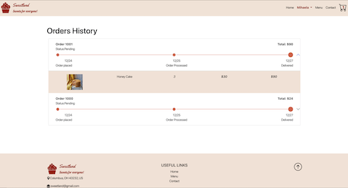

# SweetLand
SweetLand is a fully functional project that I created for my Web Database Development class at Columbus State Community College.
The technologies used to build this web application are PHP, MySQL, SASS, CSS, Bootstrap, and JavaScript.

## Functionality 

There are two sides to this project: a user with an account or without an account. When a potential client visits the site the first time they see the content from the image below which represents the home page.

From home page, the user can navigate to pages like Menu, Contact, and Shopping Cart.

When a user without an account wants to place an order, the application gives the option to add items to the cart but to finalize the order a user is required to sign in or to create an account. 

The create account page contains a form that collects user information and stores it in the database. All inputs of the form are validated and if incorrect input is introduced, an error will be displayed below the input.

The sign in page:

After a user creates an account and log in more functionality is available to the site; for example, the home page and navigation bar are changed as shown in the image below:
 

Now, users can not only add/remove items to/from the cart and place orders, but also add/remove items to/from their favorite list, see orders history, and add a profile picture or update account information.

When the add to cart or like button is clicked, the respective item is added to the cart and to the user's favorite page and the buttons turn to remove from the cart and unlike as shown in the images below.

To update the account information or image, a user must go to the account page and simply introduce the new information that they want and push the update button. When such changes occur, user information will update in the database and everywhere on the site as well (like the name in navigation). 

After placing an order, the user has the possibility to view order status and details under the history/orders page. 

## Demo Video 

To show you how my application work, I created a video that can be viewed [here].

