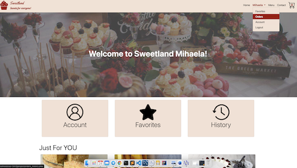
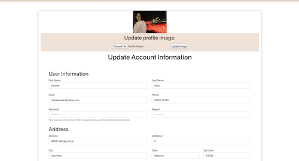

# SweetLand
SweetLand is a fully functional project that I created for my Web Database Development class at Columbus State Community College.
The technologies used to build this web application are PHP, MySQL, SASS, CSS, Bootstrap, and JavaScript.

## Functionality 

There are two sides of this project: an user with account or without an account. When a potential client visits the site first time they see the content from the image bellow which represents the home page.

From home page, the user can navigate to pages like Menu, Contact, and Shopping Cart.

When an user without an account want to place an order, the application give the option to add items to the cart but to finalize the order an user is required to sign in or to create an account. 

The create account page contains a form that collect user information and store it in the database. All inputs of the form are validated and if incorrect input is introduced, and error will be displayed bellow the input.

The sign in page:

After an user creates an account and log in more functionality is available to the site; for example, the home page and navigation bar are changed as shown in the image bellow:
 

Now, users can not only add/remove items to/from the cart and place orders, but also to add/remove items to/from their favorite list, see orders history, and add an profile picture or update account information.

When the add to cart or like button is clicked, the respective item is added to cart and to user's favorite page and the buttons turn remove from cart and unlike as shown in the images bellow.

To update the account information or image, an user have to go to the account page and simply introduce the new information that they want and push the update button. When such changes occur, user information will update in the database and everywhere on the site as well (like the name in navigation). 

After placing an order, the user have the possibility to view order status and details under the history page. 

